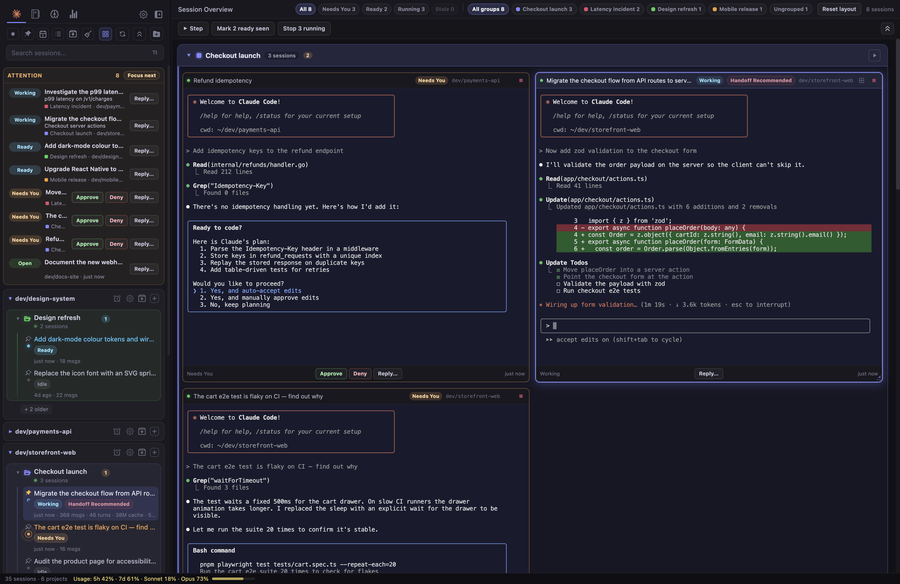
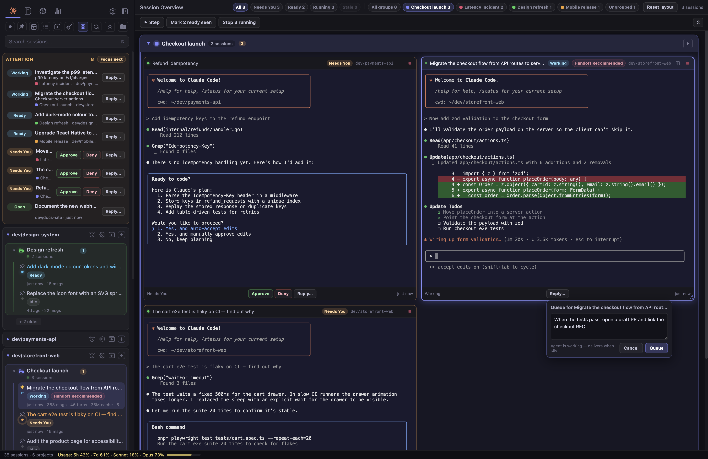
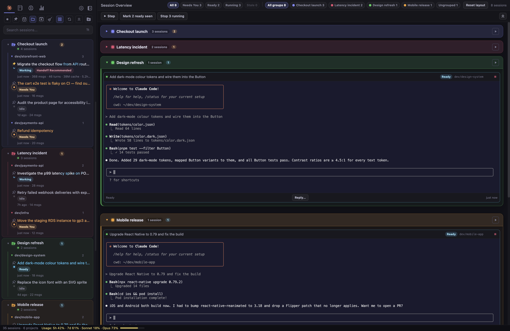
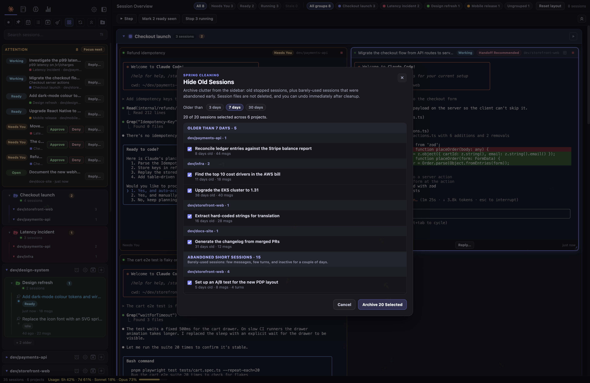
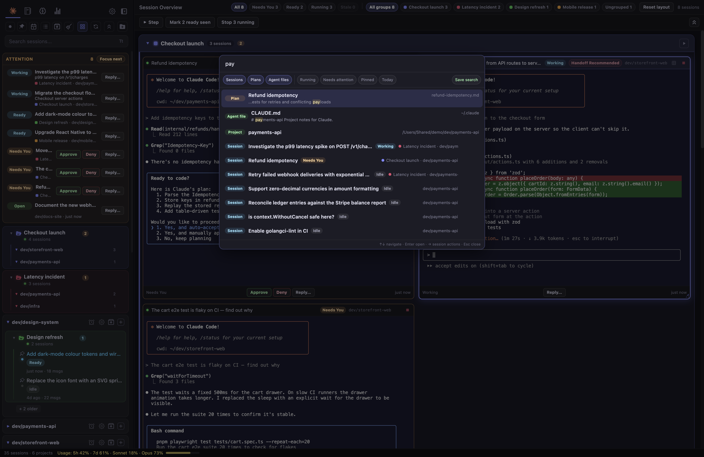
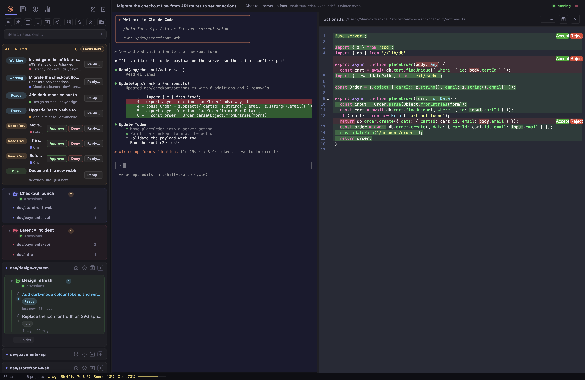
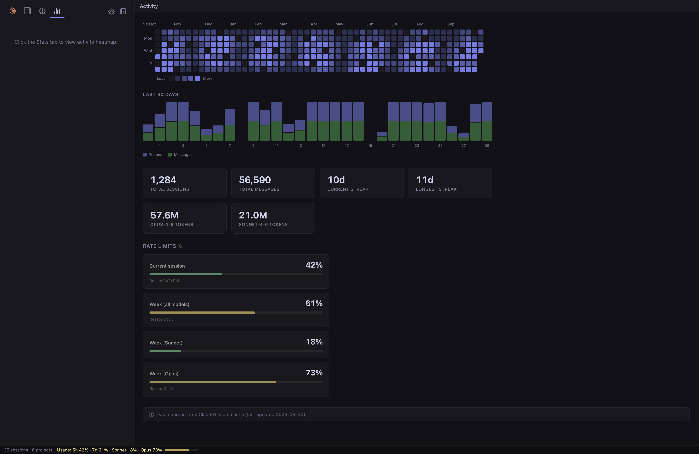

# Switchboard

**Mission control for your Claude Code agents.**

Run a whole fleet of coding agents side by side. See at a glance which ones are working, which are done and which are waiting on you. Approve or reply without switching tabs, sort agents into colour-coded folders, and sweep away the sessions you're finished with, all from one desktop app.

**[Download](https://github.com/HaydnG/switchboard/releases/latest)** · **[Watch the demo](#see-it-in-action)** · **[What's new in this fork](#a-fork-that-became-its-own-app)**



## See it in action

https://github.com/user-attachments/assets/e6401149-b67a-4a4c-9856-1272cd28ee34

One minute, real app, dummy data: approving an agent from its card, creating a folder, dragging sessions into it, and spring cleaning 20 stale sessions.

## A fork that became its own app

Switchboard started as a fork of [doctly/switchboard](https://github.com/doctly/switchboard), a clean session browser and terminal for Claude Code. Huge thanks to Doctly for that foundation.

Since forking at upstream `v0.0.30`, it has been rebuilt around a different idea: **you're not browsing sessions, you're supervising a team of agents.** The result is almost an entirely different app:

- **132 commits** and roughly **25,000 new lines** of app code since the fork
- **53 test files** covering the new status, grouping, health, cleanup and queue logic (the upstream had one when this fork began)
- A new **session status model** that knows the difference between Working, Ready, Needs You, Running and Exited, and stays correct across restarts
- A **grid command center**, **folders**, an **attention inbox**, **quick actions**, a **prompt queue**, **spring cleaning**, **session health and handoff**, a **command palette**, **git-aware cards**, **usage monitoring**, **native notifications**, **Pi and omp runtimes**, and a long list of reliability, packaging and security hardening

The full breakdown lives in [docs/fork-features.md](docs/fork-features.md).

## Why Switchboard

- **Never miss an agent that's waiting on you.** Every session that needs a decision lands in one prioritised inbox, with OS notifications, a dock badge and a hotkey to jump to the next one.
- **Answer without context switching.** Approve, deny or reply from a grid card or the inbox. Busy agents get your message queued and delivered the moment they go idle.
- **Organise by what you're working on, not where the code lives.** Folders cut across projects ("Checkout launch", "Latency incident"), drive the grid layout, and support drag and drop.
- **Keep things lean.** Health scores flag sessions that are getting long and expensive, one click hands off to a fresh session, and spring cleaning archives the clutter.

## Features at a glance

**Run a fleet**

- **Session Grid** — Every open agent as a live terminal card, laid out in colour-coded folder regions with status and folder filters
- **Attention Inbox** — A prioritised queue of every session that needs you, with a "Focus next" jump and a keyboard shortcut
- **Quick Actions** — Approve, deny, or reply to a waiting agent straight from the inbox or a grid card, without focusing its terminal
- **Prompt Queue** — Compose instructions for a busy agent; they deliver automatically, one per turn, when it goes idle
- **Git-Aware Cards** — Each live session's card shows its branch and uncommitted changes at a glance
- **Native Notifications** — OS notifications, dock/taskbar badge, and a tray icon when an agent needs you, even when Switchboard is in the background
- **Multiple Runtimes** — Launch Claude Code, Pi, or omp sessions from the same place

**Stay organised**

- **Folders** — Named, colour-coded session groups in the sidebar and grid, with a folder-first sidebar view and drag-to-file
- **Spring Cleaning** — Archive old and abandoned sessions in bulk, with undo
- **Command Palette** — `Cmd/Ctrl+K` to jump to any session, project, plan, or app action
- **Unified Discovery** — Search transcripts, plans, and agent files together with highlighted context, smart filters, saved searches, and deep actions
- **Local Notes & Tags** — Attach private metadata without writing it into agent transcripts

**Stay in control**

- **Session Health & Handoff** — Flags long, expensive sessions and turns "Handoff Recommended" into a one-click fresh start with a context packet
- **Context Transfer** — Review a bounded local packet, then seed a clean session or send it to another active agent
- **Schedule Supervision** — See next runs, recent outcomes, failures, and manual-run status for scheduled tasks
- **Usage Monitoring** — Live Claude usage limits (5h / weekly / Opus / Sonnet / quota) with a durable cache
- **Power-User Guidance** — Built-in shortcuts, first-run guidance, sidebar multi-select, and privacy-safe diagnostics export

**The foundations** (from the original Switchboard, and still here)

- **Session Browser** — All your Claude Code sessions, organised by project, searchable by content
- **Built-in Terminal** — Connect to running sessions or launch new ones without leaving the app
- **Fork & Resume** — Branch off from any point in a session's history
- **Full-Text Search** — Find any session by what was discussed, not just when it happened
- **IDE Emulation** — Claude's file opens and proposed edits appear in a side panel where you can accept, reject, or edit them. Turn it off in Global Settings if you prefer your own editor (VS Code, Cursor, etc.)
- **Plans & Memory** — Browse and edit your plan files and CLAUDE.md memory in one place
- **Activity Stats** — Heatmap of your coding activity across all projects
- **Session Names** — Picks up session names from Claude Code's `/rename` command automatically

## Session Grid Overview

Toggle the grid overview from the sidebar (or `Cmd/Ctrl+Shift+G`) for a bird's-eye view of every open session, arranged into your folders.



- **Live terminals** — Every open session renders its full terminal in a card, so you can watch many agents at once.
- **Folder regions** — Cards sit inside labelled, colour-coded regions for each folder (plus an Ungrouped region). Collapse a region, or launch every member with one click.
- **Status at a glance** — Each card shows a status chip (Needs You / Ready / Working / Running / Exited / Idle), an indicator dot, and last-activity timestamp.
- **Git-aware cards** — The header shows the session's branch and uncommitted changes (`+12 −3`), plus a Handoff Recommended chip when a session is getting long.
- **Status and folder filters** — Filter the grid to All / Needs You / Ready / Running, and to a single folder, with live counts on every chip.
- **Quick actions** — Approve, Deny, or Reply to a waiting agent from the card footer without focusing its terminal.
- **Prompt queue** — Reply to a busy agent and the message is queued; it's delivered automatically, one per turn, when the agent goes idle.
- **Bulk actions** — Step through the attention queue, mark all ready sessions as seen (with undo), or stop all running sessions (with a confirmation listing what's affected).
- **Auto-open running sessions** — Sessions with a live process show up in the grid automatically by reattaching, never by spawning a new `claude`.
- **Flexible layout** — Resize cards (snap-to-grid spans) and drag to reorder them; the layout persists across restarts. "Reset layout" restores the uniform grid.
- **Click to focus, double-click to expand** — Click a card header to focus it; double-click to switch to the single-terminal view for that session.

## Folders

Organise agents into named, colour-coded **folders** that cut across projects, e.g. "Checkout launch" or "Latency incident", on top of the automatic project and slug grouping.



- **Folder-first sidebar** — Flip the sidebar toggle to make your folders the top level, with each folder's sessions listed under their project. Switch back to the directory-first view at any time.
- **Create in seconds** — Hit a session's folder button, pick "New group…", name it and choose a colour.
- **Drag to file** — Drag a session row onto a folder to move it there, or start a new session straight from a folder's header.
- **The grid follows** — Every folder gets its own region in the grid, and the grid's folder filter shows one folder at a time.
- **Rolled-up counts** — A collapsed folder still shows how many of its sessions need you.
- **Launch all** — Open every member of a folder in one click (skipping ones already open).
- **Persistent** — Membership, collapse state, and the sidebar view are saved across restarts.

## Spring Cleaning

Old conversations pile up fast. Spring cleaning finds sessions you've finished with, both ones that haven't been touched in days and short ones you abandoned after a turn or two, and archives them from the sidebar in one go.



- **Conservative by default** — Never touches starred, archived, or live sessions. Pick the age cutoff (3, 7, or 30 days) and untick anything you want to keep.
- **Non-destructive** — Sessions are archived, not deleted. Session files stay on disk and you can undo straight after.

## Command Palette & Discovery

Press `Cmd/Ctrl+K` to jump to any session, project, plan, or agent file, or to run an app action.



- **One search box for everything** — Sessions, plans, and `CLAUDE.md` files are searched together, with live status, folder, and project shown on each result.
- **Smart filters and saved searches** — Narrow to running, needs-attention, pinned, or today, and save searches you run often.

## File Preview Side Panel & Claude IDE MCP Emulator

Switchboard can act as an IDE for your Claude Code sessions. When enabled, Claude's file opens and proposed edits appear in a side panel next to the terminal instead of being sent to an external editor.



- **Diff review** — When Claude proposes a file change, it shows up as a diff in the side panel. You can review the changes and accept or reject them directly.
- **Inline & side-by-side** — Toggle between inline (unified) and side-by-side diff views. Your preference is remembered across sessions.
- **Partial acceptance** — In inline mode, you can accept or reject individual chunks within a diff, then submit the final result.
- **File viewer** — Clickable file links in terminal output (OSC 8 hyperlinks) open in the side panel with syntax highlighting.

To disable IDE emulation entirely (e.g. if you want Claude to use VS Code or Cursor instead), uncheck **IDE Emulation** in **Global Settings**. This stops Switchboard from registering as an IDE, so Claude CLI will discover and connect to your real editor. Changes take effect on new sessions; running sessions are not affected.

## Attention & Notifications

Switchboard monitors all your sessions in the background, so you can tell at a glance which ones need you, even while you're working in a different one. The **Attention** inbox at the top of the sidebar lists every waiting session with inline Approve / Deny / Reply buttons, and **Focus next** steps through them in priority order.

- **Waiting for input** — A session that needs your response is highlighted so you don't miss it.
- **Permission approval** — When an agent is blocked waiting for a permission grant, its badge tells you immediately.
- **Activity indicators** — See which sessions are working, ready, idle, or finished.

### Notify me even when I look away

The attention signal follows you out of the app window:

- **Native OS notifications** when a session needs you while Switchboard is unfocused. Click one to focus the window and that session.
- **Dock / taskbar badge** showing how many sessions are in the inbox, and a **tray icon** with a summary tooltip and quick menu (Open / Focus next attention / Quit).
- **Coalesced & throttled** — Five agents finishing at once become one "5 sessions need you", not five toasts.
- **Hotkey** (default `Cmd/Ctrl+Shift+A`) to jump to the next session needing attention, and an optional **alert sound** on a new "Needs You".
- **Reliable detection** via Claude Code hooks (catches permission/tool prompts the terminal heuristic misses), with the original heuristic as a fallback. Opt-in in Global Settings.

Toggle notifications, sound, and notify-on-Ready in **Global Settings**.

## Agent Supervision

Switchboard treats your sessions like an agent control room: it shows not just *that* a session changed, but what it's doing and whether it's getting expensive.

- **Session health** — Each session is rated Healthy → Growing → Marathon Risk → Handoff Recommended based on turns, transcript size, active time, and cache-read tokens, showing exactly which thresholds it crossed.
- **One-click handoff** — When a session gets long or expensive, a guided flow asks the agent for a handoff packet, starts a fresh lean session seeded with it, and switches to it. Every token-spending step is explicit.
- **"While you were away"** — Returning to a session shows a dismissible summary of what happened and which files it touched since you last looked.
- **Per-session timeline** — A searchable event log (started, busy, needs-you, ready, exited, stopped, forked) separate from raw scrollback.
- **Safer controls** — App-styled confirmation dialogs for destructive actions, with affected counts and names, and an undo path where supported.

## Activity Stats & Usage

The Stats tab shows a year-long activity heatmap, your last 30 days of tokens and messages, streaks, per-model token totals, and your live Claude rate limits. The status bar keeps current usage visible everywhere else.



- **Usage monitoring** — Live Claude usage limits (5h, weekly, Opus, Sonnet, extra-usage quota), with a durable cache that survives rate limits.

## Editor

| Shortcut | Action |
|----------|--------|
| `Cmd+F` / `Ctrl+F` | Find in file (also works in terminal) |
| `Cmd+G` / `Ctrl+G` | Go to line |
| `Cmd+K` / `Ctrl+K` | Command palette (sessions, projects, actions) |
| `Cmd+Shift+A` / `Ctrl+Shift+A` | Focus next session needing attention |
| `Cmd+Shift+G` / `Ctrl+Shift+G` | Toggle grid overview |

## Download

Grab the latest release for your platform:

**[Download Switchboard](https://github.com/HaydnG/switchboard/releases/latest)**

- **macOS**: `.dmg` (Apple Silicon & Intel)
- **Windows**: `.exe` installer
- **Linux**: `.AppImage`, `.deb`, or `.pacman` (Arch/Manjaro)

### macOS: first launch (unsigned build)

These builds are **not code-signed or notarized by Apple**, so macOS Gatekeeper will block the app on first launch ("Switchboard is damaged" / "cannot be opened because the developer cannot be verified"). This is expected — to approve it:

1. Move **Switchboard.app** to `/Applications` and double-click it once (it will be blocked).
2. Open **System Settings → Privacy & Security**, scroll to the **Security** section, and click **Open Anyway** next to the Switchboard message.
3. Confirm **Open** in the dialog. You only need to do this once.

If it still won't open, clear the quarantine attribute from a terminal:

```bash
xattr -dr com.apple.quarantine /Applications/Switchboard.app
```

> **macOS updates use a manual bundle swap.** These builds are unsigned, so Switchboard cannot hand the download to Apple's Squirrel installer. After an update is downloaded, restarting the app replaces `Switchboard.app` in place, strips quarantine, and relaunches. You may still need Gatekeeper's **Open Anyway** step after a fresh install. Windows and Linux builds auto-update normally.

## Prerequisites

- **Node.js** 20+
- **npm** 10+
- Platform build tools for native modules:
  - **macOS**: Xcode Command Line Tools (`xcode-select --install`)
  - **Linux**: `build-essential`, `python3` (`sudo apt install build-essential python3`)
  - **Windows**: Visual Studio Build Tools or `npm install -g windows-build-tools`

## Development Setup

```bash
# Install dependencies (runs postinstall automatically)
npm install

# Start the app
npm start

# Full local quality gate
npm run check

# Isolated Electron startup smoke test
npm run smoke
```

`npm start` bundles CodeMirror and launches Electron. For faster iteration after the first run:

```bash
npm run electron
```

### Regenerating the README screenshots

The screenshots come from a demo with made-up projects, git repos, transcripts, and a scripted stand-in for `claude`, so no real sessions or credentials are shown. The demo runs under its own home directory (`/Users/Shared/demo` on macOS) with isolated app data, fullscreen at your display's native resolution.

```bash
npm run screenshots                  # all shots, written to build/
npm run screenshots -- hero cleanup  # only the named shots
SB_DEMO_KEEP=1 npm run screenshots -- none  # just launch the demo and leave it running
npm run demo:video                   # promo video → dist/demo/ (needs ffmpeg; SB_FFMPEG=/path overrides)
```

The window takes over the screen while it records, so leave the machine alone for a minute or two.

## Building

All build commands bundle CodeMirror first, then invoke electron-builder.

```bash
# Current platform
npm run build

# Platform-specific
npm run build:mac     # DMG + zip (arm64 + x64)
npm run build:win     # NSIS installer (x64 + arm64)
npm run build:linux   # AppImage + deb + pacman (x64 + arm64)
```

Output goes to `dist/`.

### Building on Arch / Manjaro

The `deb` and `pacman` targets are built via the `fpm` binary bundled by
electron-builder, which links against `libcrypt.so.1`. Arch ships `libxcrypt`
without that legacy ABI, so install the compat shim once:

```bash
sudo pacman -S libxcrypt-compat
```

`AppImage` builds without it.

The pacman package is published as **`switchboard-doctly`** rather than
`switchboard` because the Arch `extra` repo already ships a package named
`switchboard` (elementary OS's Pantheon Control Center). Renaming avoids the
file-conflict that would block installation alongside it. The app itself is
still called Switchboard everywhere users see it — only the package identity
changes. Uninstall later with `sudo pacman -R switchboard-doctly`.

## Releasing

Releases are driven by git tags:

```bash
git tag v0.1.0
git push origin v0.1.0
```

The GitHub Actions workflow builds for all platforms and publishes to GitHub Releases. You can also release locally:

```bash
npm run release   # builds + publishes to GitHub Releases
```

Set `GH_TOKEN` in your environment (a GitHub personal access token with `repo` scope).

## Auto-Updates

The app uses `electron-updater` to check for updates from GitHub Releases on launch and every 4 hours. Updates are only checked in packaged builds (not during development). The flow:

1. App auto-downloads updates in the background
2. A toast notification appears when the update is ready
3. User can restart immediately or dismiss (installs on next quit)

> **macOS:** unsigned builds skip Squirrel.Mac and install the downloaded zip with a local bundle swap + relaunch (see `docs/macos-unsigned-update-fix.md`). Windows and Linux keep the standard `electron-updater` install path.

## Code Signing

For distribution, set these environment variables:

- **macOS**: `CSC_LINK` (p12 certificate) and `CSC_KEY_PASSWORD`, or sign via Keychain
- **Windows**: `CSC_LINK` and `CSC_KEY_PASSWORD` for EV/OV code signing
- Set `CSC_IDENTITY_AUTO_DISCOVERY=false` to skip signing (CI artifact builds)

The macOS build uses custom entitlements (`build/entitlements.mac.plist`) to allow JIT and unsigned memory execution, required by native modules (node-pty, better-sqlite3).

## Project Structure

```
main.js            Electron main process
preload.js         Context bridge (IPC bindings)
db.js              SQLite session cache & metadata
public/            Legacy renderer and pure supervision/productivity modules
src/renderer/       React/TypeScript shell, design system, typed API and stores
test/              Unit tests (node --test) for the pure modules
docs/              Feature specs & roadmap (see docs/fork-features.md)
scripts/           Build & postinstall scripts
build/             Icons, entitlements, builder resources
.github/workflows/ CI/CD
```
